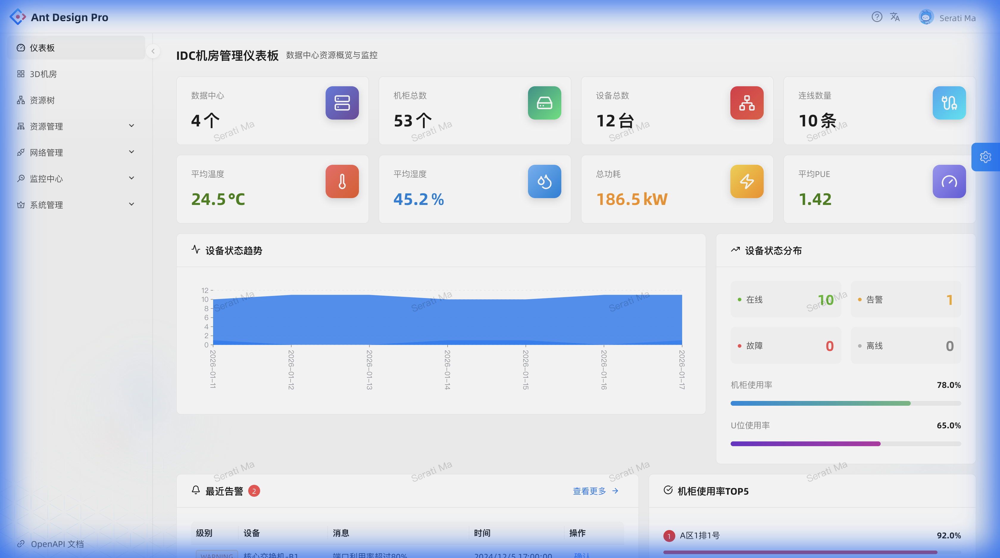
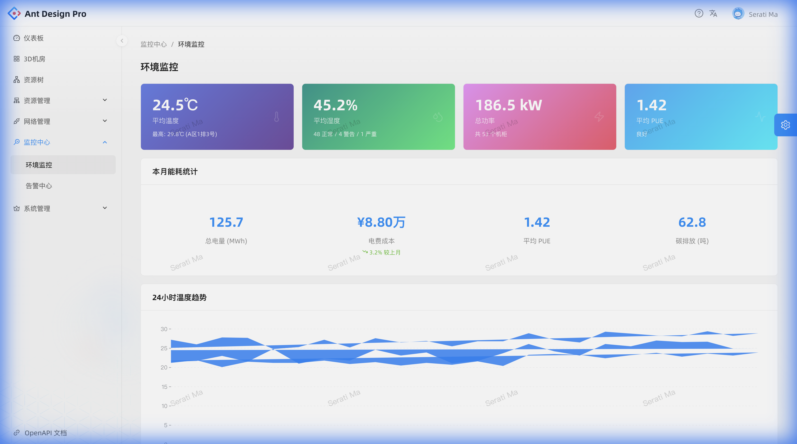
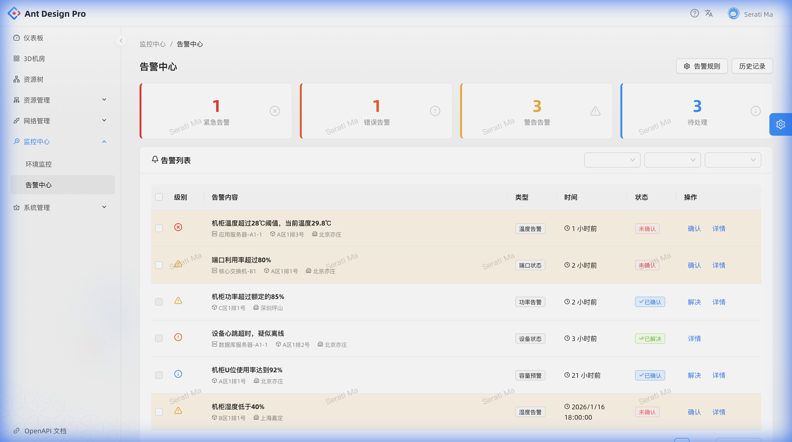
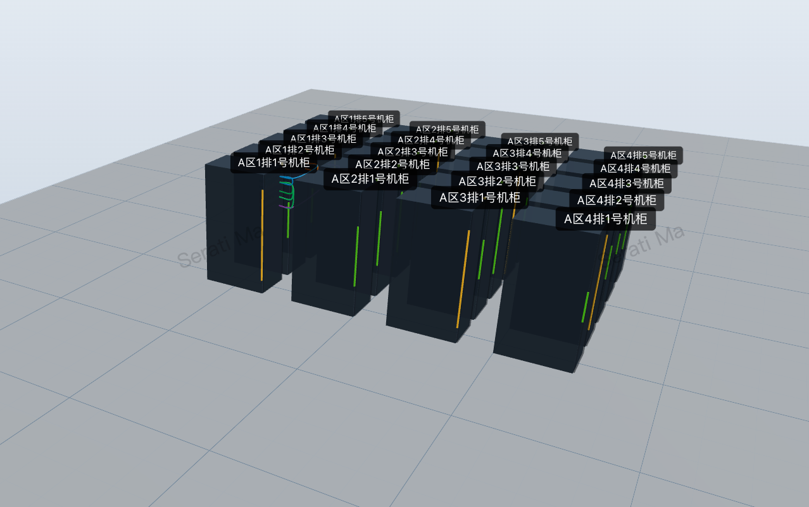
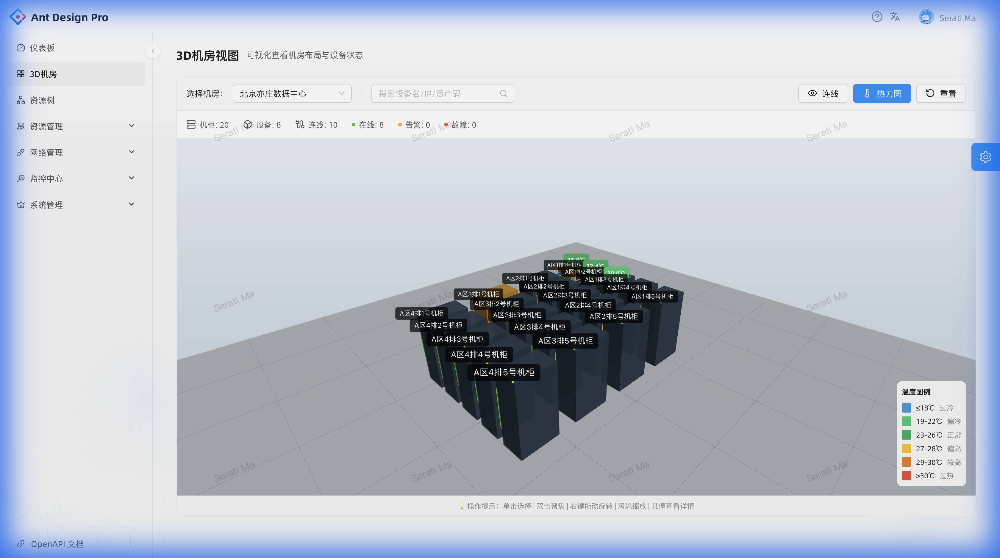
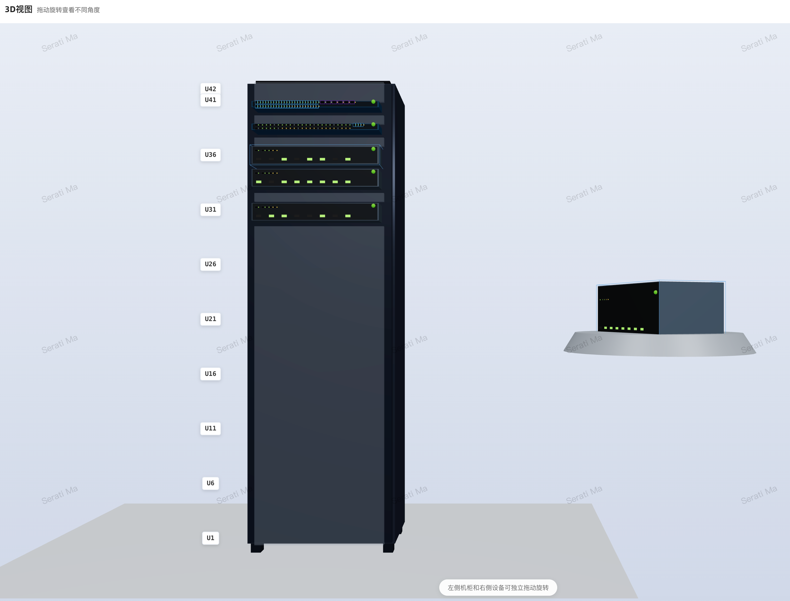
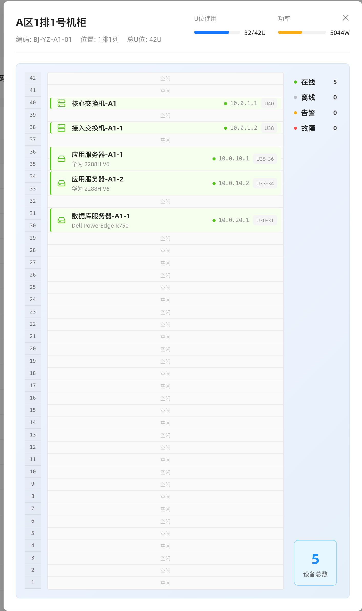
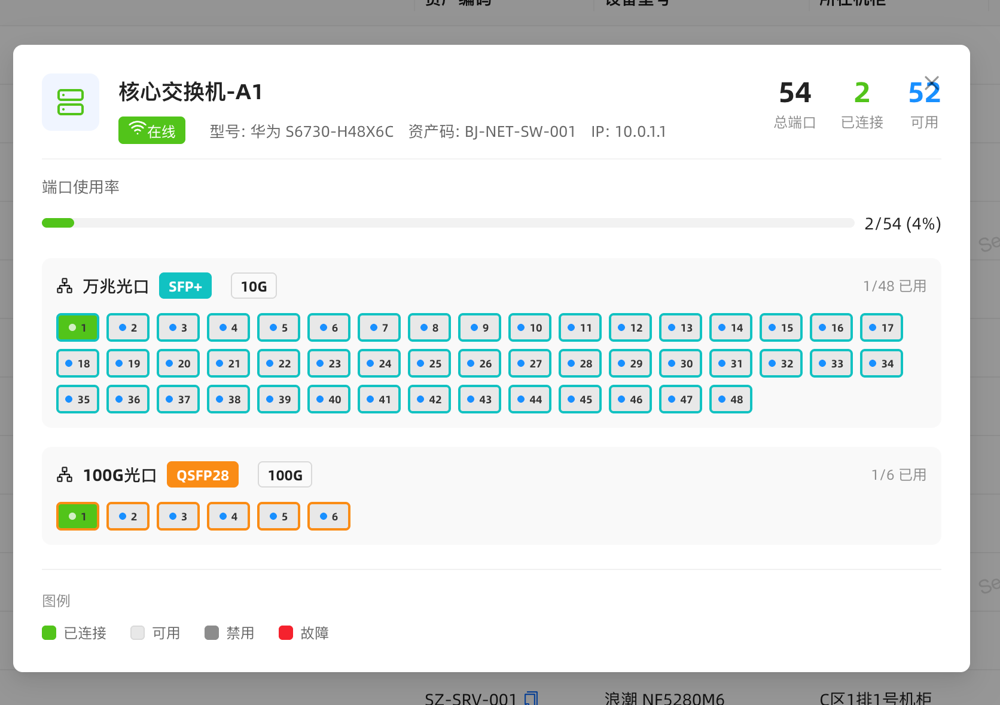
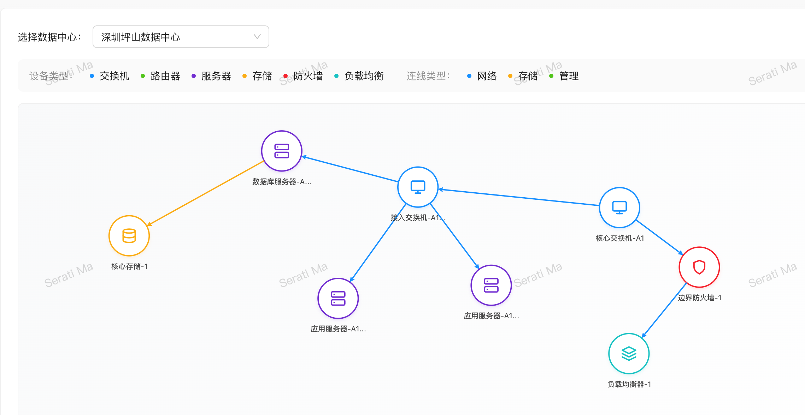

# 3D-DataCenter

<div align="center">

**3D Visualization Management System for Data Centers based on Three.js**

A modern and powerful data center infrastructure management platform with immersive 3D visualization experience

English | [简体中文](./README.md)

[](https://react.dev/)
[](https://threejs.org/)
[](https://ant.design/)
[](https://www.typescriptlang.org/)
[](./LICENSE)

</div>

## ✨ Features

### 🎯 Core Features

- **🏢 Data Center Management** - Complete hierarchical management from data centers to cabinets to devices
- **📦 Cabinet Visualization** - Realistic 3D cabinet views, intuitively displaying device positions and status
- **🔧 Device Management** - Full lifecycle management of servers, switches, routers, and other devices
- **🔌 Port Management** - Detailed network port configuration and connection management
- **🌐 Network Topology** - Visualized network topology showing connections between devices
- **📊 Resource Monitoring** - Real-time monitoring of U-space usage, device status, and other key metrics

### 🌡️ Environment Monitoring & Energy Management (NEW)

- **📈 Real-time Environment Monitoring** - Temperature and humidity monitoring with trend analysis
- **⚡ Energy Management** - Power consumption statistics, PUE calculation, electricity cost analysis
- **🔥 3D Heatmap** - Cabinet temperature heatmap overlay, visually displaying temperature distribution
- **📉 Carbon Emission Statistics** - Carbon emission calculation and environmental metrics

### 🔔 Alert Center (NEW)

- **⚠️ Smart Alerts** - Multi-level alerts (Critical/Error/Warning/Info)
- **📋 Alert Rules** - Customizable alert thresholds and trigger conditions
- **📜 Alert History** - Complete alert records and processing traceability
- **✅ Quick Acknowledgment** - One-click alert confirmation for efficient handling

### 🎨 3D Visualization Experience

- **🖱️ Interactive Rotation** - Independent drag-to-rotate for cabinets and devices, multi-angle viewing
- **🎯 Device Detail Display** - Click devices to view enlarged 3D models with front/rear panels and port distribution
- **🎨 Status Visualization** - Different colors intuitively show device status (online/offline/warning)
- **🔥 Temperature Heatmap** - Real-time temperature visualization with color mapping (Blue→Green→Yellow→Red)
- **⚡ Alert Flashing** - Dynamic flashing effect for alert devices, quickly locate issues
- **📏 Precise Positioning** - U-space ruler clearly marks device positions at a glance
- **🌈 Realistic Lighting** - Physics-based rendering for near-realistic visual effects

### 💻 Technical Highlights

- **⚛️ React 19** - Latest React technology stack
- **🎮 Three.js + React Three Fiber** - High-performance 3D rendering engine
- **🎨 Ant Design Pro** - Enterprise-level design system for admin interfaces
- **📱 Responsive Design** - Perfect adaptation to various screen sizes
- **🔒 TypeScript** - Complete type safety guarantee
- **🎯 Component Architecture** - Highly reusable component design

## 📸 Preview

### Dashboard


### Environment Monitoring


### Alert Center


### Data Center 3D View


### 3D Heatmap


### Cabinet 3D View


### Cabinet Layout


### Device Ports


### Network Topology


## 🚀 Quick Start

### Prerequisites

- Node.js >= 20.0.0
- npm or yarn or pnpm

### Installation

```bash
# Clone the repository
git clone https://github.com/go-laoji/3d-datacenter.git

# Navigate to project directory
cd 3d-datacenter

# Install dependencies
npm install
# or
yarn
# or
pnpm install
```

### Development

```bash
# Start development server
npm start

# Start development server (without Mock data)
npm run start:no-mock

# Start development server (connect to the local database-backed backend)
npm run start:test
```

Visit [http://localhost:8000](http://localhost:8000) to view the application.

### Build

```bash
# Build for production
npm run build

# Preview production build
npm run preview
```

## 📦 Project Structure

```
front/
├── config/              # UmiJS configuration
├── public/              # Static assets
├── src/
│   ├── components/      # Common components
│   │   └── 3d/         # 3D-related components
│   │       ├── DeviceModels.tsx      # Device 3D models
│   │       ├── PortRenderer3D.tsx    # Port renderer
│   │       └── ...
│   ├── pages/          # Page components
│   │   ├── Cabinet3D/       # Cabinet 3D view
│   │   ├── Datacenter3D/    # Data center 3D view
│   │   ├── Topology/        # Network topology
│   │   └── ...
│   ├── services/       # API services
│   ├── utils/          # Utility functions
│   └── app.tsx         # Application entry
├── types/              # TypeScript type definitions
└── package.json
```

## 🎮 User Guide

### Data Center Management

1. **Create Data Center** - Add a new data center on the data center page
2. **Add Cabinet** - Add cabinets to the data center, configure U-space height, position, etc.
3. **Device Installation** - Add devices to cabinets, specify start and end U-space positions
4. **Configure Ports** - Add network port configurations for devices
5. **Establish Connections** - Create network connections between devices

### 3D View Operations

- **Rotate View** - Drag mouse on cabinet or device to rotate 3D model
- **Select Device** - Click device to view detailed information and enlarged 3D model
- **View Ports** - Rotate device to view port distribution on front and rear panels
- **Switch Perspective** - Use control buttons to switch different perspectives and display modes

## 🛠️ Tech Stack

### Frontend Framework
- [React 19](https://react.dev/) - User interface library
- [UmiJS 4](https://umijs.org/) - Enterprise-level frontend application framework
- [Ant Design Pro](https://pro.ant.design/) - Out-of-the-box UI solution for enterprise applications

### 3D Rendering
- [Three.js](https://threejs.org/) - JavaScript 3D library
- [React Three Fiber](https://docs.pmnd.rs/react-three-fiber) - Three.js renderer for React
- [Drei](https://github.com/pmndrs/drei) - Utility collection for React Three Fiber

### UI Components
- [Ant Design](https://ant.design/) - Enterprise-class UI design language and React component library
- [Ant Design Charts](https://charts.ant.design/) - Simple and easy-to-use React chart library
- [Lucide React](https://lucide.dev/) - Elegant icon library

### Development Tools
- [TypeScript](https://www.typescriptlang.org/) - Superset of JavaScript
- [Biome](https://biomejs.dev/) - Fast code formatter and linter
- [Husky](https://typicode.github.io/husky/) - Git hooks tool
- [Jest](https://jestjs.io/) - JavaScript testing framework

## 🤝 Contributing

We welcome all forms of contributions! If you want to contribute to the project, please follow these steps:

1. Fork this repository
2. Create your feature branch (`git checkout -b feature/AmazingFeature`)
3. Commit your changes (`git commit -m 'Add some AmazingFeature'`)
4. Push to the branch (`git push origin feature/AmazingFeature`)
5. Open a Pull Request

### Development Guidelines

- Follow the project's code style
- Ensure code passes lint checks: `npm run lint`
- Add appropriate tests for new features
- Update relevant documentation

## 📝 License

This project is licensed under the [MIT](./LICENSE) License.

## 🙏 Acknowledgments

- [Three.js](https://threejs.org/) - Powerful 3D JavaScript library
- [Ant Design](https://ant.design/) - Excellent React UI library
- [React Three Fiber](https://docs.pmnd.rs/react-three-fiber) - Making Three.js easier to use in React

## 📧 Contact

If you have any questions or suggestions, feel free to contact us through:

- Submit an [Issue](https://github.com/go-laoji/3d-datacenter/issues)

## 🌟 Star History

[](https://star-history.com/#go-laoji/3d-datacenter&Date)

---

<div align="center">

**If this project helps you, please give us a ⭐️ Star!**

Made with ❤️ by [Your Name](https://github.com/go-laoji)

</div>
