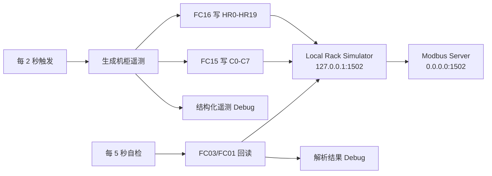

# Node-RED 机柜 Modbus TCP 仿真流程使用说明

本文介绍如何安装依赖、导入并使用 [node-red-rack-modbus-simulator.json](./node-red-rack-modbus-simulator.json)。该流程在 Node-RED 中模拟一台智能机柜，通过 Modbus TCP 对外提供温湿度、电压、电流、功率、能耗、门状态和告警状态等数据。

## 1. 流程概览

流程使用 `node-red-contrib-modbus` 提供的以下节点：

- `Modbus Server`：在 `0.0.0.0:1502` 上提供 Modbus TCP 服务并保存数据。
- `Modbus Flex Write`：使用 FC16 批量写入 Holding Registers，使用 FC15 批量写入 Coils。
- `Modbus Flex Getter`：使用 FC03 和 FC01 回读数据，完成流程内部自检。

数据流如下：



流程启动后会执行两类周期任务：

| 任务 | 周期 | 首次执行延迟 | 作用 |
| --- | ---: | ---: | --- |
| 生成并写入机柜数据 | 2 秒 | 3 秒 | 更新 HR0～HR19 和 C0～C7 |
| 本地回读自检 | 5 秒 | 6 秒/6.5 秒 | 回读并解析 Holding Registers 和 Coils |

## 2. 前置条件

开始前应满足：

- Node-RED 已安装并能够正常启动。
- 可以访问 Node-RED 编辑器，默认地址为 `http://NODE_RED_IP:1880`。
- Node-RED 运行用户可以在 `~/.node-red` 下安装 npm 包。
- TCP 端口 `1502` 没有被其他进程占用。

检查 Node-RED、Node.js 和端口：

```bash
node-red --version
node --version
ss -lnt | grep ':1502'
```

Ubuntu 22.04 上的 Node-RED 安装过程参见上一级文档：[INSTALL.md](../INSTALL.md)。

## 3. 安装 Modbus 节点

### 3.1 通过 Node-RED 页面安装

在 Node-RED 编辑器中依次进入：

```text
菜单 → Manage palette → Install
```

搜索并安装：

```text
node-red-contrib-modbus
```

### 3.2 通过命令行安装

也可以在 Ubuntu 中使用运行 Node-RED 的同一个普通用户执行：

```bash
node-red-stop
cd ~/.node-red
npm install node-red-contrib-modbus@5.45.2
node-red-start
```

不要在 `~/.node-red` 中使用 `sudo npm install`，否则可能产生 root 所有的文件，导致 Node-RED 服务无法加载或更新节点。

当前 npm 公开稳定版本为 `5.45.2`。需要确认最新版本时执行：

```bash
npm view node-red-contrib-modbus version
```

安装完成后查看日志：

```bash
node-red-log
```

确认日志中没有 `unknown node type`、模块加载失败或依赖编译错误。版本和安装方式可参考 [`node-red-contrib-modbus` npm 页面](https://www.npmjs.com/package/node-red-contrib-modbus)。

## 4. 导入流程

1. 打开 Node-RED 编辑器。
2. 点击右上角菜单，选择 **Import**。
3. 选择 **select a file to import**。
4. 选择 `node-red-rack-modbus-simulator.json`。
5. 选择导入到 **new flow**。
6. 点击 **Import**。
7. 检查所有 Modbus 节点均已正常识别，没有显示红色虚线边框或 `unknown`。
8. 点击右上角 **Deploy**。

部署后，流程页签名称为：

```text
机柜 Modbus TCP 仿真器
```

若导入时提示配置节点重名，应检查右上角菜单中的 **Configuration nodes**，避免误删其他 Flow 正在使用的 Modbus Client 配置。

## 5. Modbus 服务参数

流程中的 Modbus Server 和本地 Client 参数如下：

| 参数 | 值 | 说明 |
| --- | --- | --- |
| 协议 | Modbus TCP | 不使用 Modbus RTU/串口 |
| Server 监听地址 | `0.0.0.0` | 监听服务器所有 IPv4 接口 |
| Server 监听端口 | `1502` | 外部客户端连接端口 |
| 流程读写 Unit ID | `1` | FC01、FC03、FC15、FC16 消息使用的 Unit ID |
| Holding Register 缓冲区 | `0～999` | 共 1000 个寄存器 |
| Coil 缓冲区 | `0～999` | 共 1000 个线圈 |
| Input Register 缓冲区 | `0～999` | 本流程未写入 |
| Discrete Input 缓冲区 | `0～999` | 本流程未写入 |
| Server 响应延迟 | `10 ms` | Modbus Server 节点配置值 |
| 数据刷新周期 | `2 秒` | 更新 HR0～HR19 和 C0～C7 |
| 自检读取周期 | `5 秒` | 本机回读 HR 和 Coil |

内部 `Local Rack Simulator` Client 的连接地址为：

```text
127.0.0.1:1502
```

它既用于将生成的数据写回本机 Modbus Server，也用于周期读取数据进行自检。

这里使用 `1502` 而不是标准端口 `502`，是为了避免 Linux 普通用户绑定低于 `1024` 的特权端口。外部客户端必须显式指定端口 `1502`。

## 6. Holding Registers 数据模型

外部系统使用 **FC03（Read Holding Registers）** 读取零基地址 `0～19`，一次读取数量为 `20`。

所有寄存器均为 16 位无符号整数。小数通过固定倍率编码，客户端读取后应按表中公式换算。

| 地址 | 含义 | 原始值换算 | 单位/备注 |
| ---: | --- | --- | --- |
| HR0 | 机柜 ID | 原值 | 默认 `1` |
| HR1 | 柜内温度 | 原值 ÷ 10 | °C |
| HR2 | 湿度 | 原值 ÷ 10 | %RH |
| HR3 | 输入电压 | 原值 ÷ 10 | V |
| HR4 | 输入电流 | 原值 ÷ 100 | A |
| HR5 | 有功功率 | 原值 | W |
| HR6 | 视在功率 | 原值 | VA |
| HR7 | 累计电能低 16 位 | 原值 ÷ 10 | kWh；达到 16 位上限后回绕 |
| HR8 | 风扇转速 | 原值 | RPM |
| HR9 | 开门累计次数 | 原值 | 次；达到 16 位上限后回绕 |
| HR10 | 综合告警位掩码 | 按位解析 | 见下一节 |
| HR11 | 机柜负载率 | 原值 ÷ 10 | % |
| HR12 | 进风温度 | 原值 ÷ 10 | °C |
| HR13 | 出风温度 | 原值 ÷ 10 | °C |
| HR14 | 运行时间高 16 位 | 与 HR15 组合 | 秒 |
| HR15 | 运行时间低 16 位 | 与 HR14 组合 | 秒 |
| HR16 | 额定功率 | 原值 | 固定 `3000 W` |
| HR17 | 高温告警阈值 | 原值 ÷ 10 | 固定 `35.0 °C` |
| HR18 | 高湿告警阈值 | 原值 ÷ 10 | 固定 `70.0 %RH` |
| HR19 | 数据模型版本 | 原值 | 当前为 `1` |

运行时间组合公式：

```javascript
const uptimeSeconds = HR14 * 65536 + HR15;
```

累计电能 HR7 仅保存低 16 位，不能作为无限增长的长期电表。其最大可表达值为 `6553.5 kWh`，随后从 `0` 重新计数。如果业务需要长期累计能耗，应扩展为两个寄存器或使用其他持久化数据源。

## 7. HR10 综合告警位掩码

HR10 将多个告警压缩到一个 16 位寄存器中：

| 位 | 掩码 | 含义 | 当前触发条件 |
| ---: | ---: | --- | --- |
| bit0 | `1` | 高温 | 柜内温度 ≥ `35.0 °C` |
| bit1 | `2` | 高湿 | 湿度 ≥ `70.0 %RH` |
| bit2 | `4` | 烟感告警 | 仿真状态 `smokeAlarm=true` |
| bit3 | `8` | 水浸告警 | 仿真状态 `waterLeak=true` |
| bit4 | `16` | 电源告警 | 仿真状态 `powerAlarm=true` |
| bit5 | `32` | 风扇告警 | 仿真状态 `fanAlarm=true` |
| bit6 | `64` | 过载 | 负载率 ≥ `90%` |

JavaScript 解析示例：

```javascript
const alarmCode = HR10;
const highTemperature = (alarmCode & 1) !== 0;
const highHumidity = (alarmCode & 2) !== 0;
const smokeAlarm = (alarmCode & 4) !== 0;
const waterLeak = (alarmCode & 8) !== 0;
const powerAlarm = (alarmCode & 16) !== 0;
const fanAlarm = (alarmCode & 32) !== 0;
const overload = (alarmCode & 64) !== 0;
```

流程默认只会根据温度、湿度和负载率自动产生对应告警。烟感、水浸、电源和风扇告警的初始值为 `false`，若课程演示需要触发这些告警，可在 Function 节点中临时调整状态或增加独立的控制输入。

## 8. Coils 数据模型

外部系统使用 **FC01（Read Coils）** 读取零基地址 `0～7`，一次读取数量为 `8`。

| 地址 | 含义 | 当前逻辑 |
| ---: | --- | --- |
| C0 | 设备在线 | 固定为 `true` |
| C1 | 机柜门打开 | 低概率随机切换 |
| C2 | 烟感告警 | 默认 `false` |
| C3 | 水浸告警 | 默认 `false` |
| C4 | 电源告警 | 默认 `false` |
| C5 | 风扇告警 | 默认 `false` |
| C6 | 高温或过载严重告警 | 柜内温度 ≥ `35.0 °C`，或负载率 ≥ `90%` |
| C7 | 维护模式 | 默认 `false` |

流程内部通过 FC16 批量写入 20 个 Holding Registers，通过 FC15 批量写入 8 个 Coils。`Modbus Flex Write` 的动态消息结构为：

```javascript
msg.payload = {
    value: [/* 要写入的数组 */],
    fc: 16,          // 写多个 Holding Registers；Coils 使用 15
    unitid: 1,
    address: 0,
    quantity: 20     // Coils 使用 8
};
```

FC15/FC16 批量写入时，`msg.payload.value` 必须是数组。流程中的实际消息结构可直接查看 JSON 内的“生成机柜遥测与Modbus报文” Function 节点。

## 9. 仿真数据变化规则

流程不是每次生成完全独立的随机数，而是在上一次状态基础上进行小幅随机游走，使曲线更接近连续变化的设备遥测。

| 数据 | 仿真范围/算法 |
| --- | --- |
| 柜内温度 | `20.0～38.0 °C` |
| 湿度 | `30.0～75.0 %RH` |
| 进风温度 | `18.0～36.0 °C`，通常低于柜内温度 |
| 出风温度 | `20.0～45.0 °C`，通常高于柜内温度 |
| 输入电压 | `205.0～240.0 V` |
| 输入电流 | `0.5～12.0 A` |
| 风扇转速 | `800～3200 RPM` |
| 有功功率 | `电压 × 电流 × 0.92` |
| 视在功率 | `电压 × 电流` |
| 负载率 | `有功功率 ÷ 3000 × 100%` |
| 累计电能 | 按实际刷新间隔和有功功率累加 |
| 门状态 | 每次 2 秒刷新时有 1% 概率切换；从关闭变为打开时累计次数加 1 |

状态保存在 Function 节点的 `context.rackState` 中。重新部署该 Function 节点或重启 Node-RED 后，内存上下文可能恢复为初始值；默认配置不保证仿真状态跨重启持久化。

## 10. 地址编号注意事项

流程中的地址是 **零基 PDU 地址**：

```text
Node-RED HR0  → 某些 SCADA 软件显示为 40001
Node-RED HR1  → 某些 SCADA 软件显示为 40002

Node-RED C0   → 某些 SCADA 软件显示为 00001
Node-RED C1   → 某些 SCADA 软件显示为 00002
```

外部软件读取 Holding Registers 时优先使用：

```text
Protocol: Modbus TCP
Slave / Unit ID: 1
Start Address: 0
Quantity: 20
Function: 03 Holding Registers
Port: 1502
```

读取 Coils 时使用：

```text
Slave / Unit ID: 1
Start Address: 0
Quantity: 8
Function: 01 Coils
Port: 1502
```

若客户端只允许填写 `40001`、`00001` 形式的参考地址，则 Holding Registers 从 `40001` 开始，Coils 从 `00001` 开始。不同 SCADA/PLC 软件对地址基数的命名不同，发现数据错位时应首先检查“零基/一基地址”设置。

## 11. 查看流程内置自检

流程已经包含两条自检链路：

- `每5秒读取HR → 读取HR0-HR19 → 解析机柜HR → HR自检结果`
- `每5秒读取Coils → 读取C0-C7 → 解析机柜Coils → Coils自检结果`

部署后打开编辑器右侧 **Debug** 面板，可以看到解析后的结构化结果。

同时可以查看：

- `机柜结构化遥测`：生成端的原始结构化数据。
- `Modbus原始响应（非错误，默认关闭）`：汇总 FC15、FC16、FC03 和 FC01 节点的第二路输出。这些消息用于查看 Modbus 原始响应，不代表流程发生错误；该 Debug 节点默认关闭，需要分析协议报文时再手动启用。
- `捕获真正的节点错误 → 真正的流程错误`：Catch 节点捕获可处理的节点运行错误，并将完整错误消息输出到 Debug 面板。判断流程是否真正异常时应优先查看这里。
- `Server事件（默认关闭）`：Modbus Server 事件；需要时手动启用，避免正常运行时产生过多日志。

如果自检持续报 `ECONNREFUSED`，检查 `Rack Modbus Server :1502` 是否已经启动，以及端口 `1502` 是否被其他进程占用。

> 不要仅因为 `Modbus Flex Write` 或 `Modbus Flex Getter` 的第二路输出出现消息就判定写入或读取失败。当前流程已将该输出明确标记为“原始响应”；真正的节点异常由 Catch 链路统一捕获。

## 12. 使用 mbpoll 测试

在 Node-RED 主机或另一台 Linux 客户端上安装 `mbpoll`：

```bash
sudo apt update
sudo apt install -y mbpoll
```

### 12.1 读取 Holding Registers

```bash
mbpoll \
  -m tcp \
  -a 1 \
  -p 1502 \
  -0 \
  -t 4 \
  -r 0 \
  -c 20 \
  -1 \
  NODE_RED_IP
```

### 12.2 读取 Coils

```bash
mbpoll \
  -m tcp \
  -a 1 \
  -p 1502 \
  -0 \
  -t 0 \
  -r 0 \
  -c 8 \
  -1 \
  NODE_RED_IP
```

关键参数：

| 参数 | 含义 |
| --- | --- |
| `-m tcp` | 使用 Modbus TCP |
| `-a 1` | Unit/Slave ID 为 1 |
| `-p 1502` | TCP 端口为 1502 |
| `-0` | 使用从 0 开始的 PDU 地址 |
| `-t 4` | 读取 Holding Registers |
| `-t 0` | 读取 Coils |
| `-r 0` | 起始地址为 0 |
| `-c` | 读取数量 |
| `-1` | 只轮询一次 |

例如 Node-RED 主机地址是 `192.168.1.100`：

```bash
mbpoll -m tcp -a 1 -p 1502 -0 -t 4 -r 0 -c 20 -1 192.168.1.100
mbpoll -m tcp -a 1 -p 1502 -0 -t 0 -r 0 -c 8 -1 192.168.1.100
```

`mbpoll` 参数定义可参考 [Debian mbpoll manpage](https://manpages.debian.org/bookworm/mbpoll/mbpoll.1.en.html)。

## 13. 网络与防火墙

### 13.1 确认监听状态

在 Node-RED 主机执行：

```bash
ss -lntp | grep ':1502'
```

也可以从客户端测试 TCP 连通性：

```bash
nc -vz NODE_RED_IP 1502
```

### 13.2 UFW 放行

优先只允许可信网段访问。例如只允许 `192.168.1.0/24`：

```bash
sudo ufw allow from 192.168.1.0/24 to any port 1502 proto tcp
sudo ufw status
```

如果是完全隔离的实验网络，也可以放行所有来源：

```bash
sudo ufw allow 1502/tcp
sudo ufw status
```

Modbus TCP 本身不提供加密和可靠的身份认证。不要将 `1502` 端口直接暴露到互联网；跨网络访问应使用 VPN、防火墙白名单或其他隔离措施。

如果 Node-RED 运行在 Docker 中，还需要发布编辑器和 Modbus 端口：

```yaml
ports:
  - "1880:1880"
  - "1502:1502"
```

同时确认容器内导入的 Server 节点监听地址仍为 `0.0.0.0`，不能改为 `127.0.0.1`，否则宿主机端口映射无法访问该服务。

## 14. 与 datacenter-mgmt 系统对接

后端通过 Modbus TCP 主动读取本流程提供的数据，并通过 SSE 实时推送到数字孪生大屏。当前仿真器连接信息为：

```text
Protocol: Modbus TCP
Host: 192.168.244.144
Port: 1502
Unit ID: 1
```

在 `datacenter-mgmt` 中进入“资源管理 → 机柜管理”，编辑目标机柜并切换到“遥测采集配置”页签，填写：

| 配置项 | 值 |
| --- | --- |
| 采集源标识 | `rack-simulator-1` |
| 采集状态 | 启用 |
| 采集协议 | Modbus TCP |
| 主机地址 | `192.168.244.144` |
| 端口 | `1502` |
| Unit ID | `1` |
| 超时 | `1800 ms` |

保存前可点击“测试遥测数据采集”。测试结果弹窗会立即读取一次数据，之后每隔 2 秒刷新最新值，并按照返回的遥测结构动态展示字段。

高低频周期继续通过根目录 `.env` 配置：

```dotenv
CABINET_TELEMETRY_LOW_FREQUENCY_SECONDS=60
CABINET_TELEMETRY_HIGH_FREQUENCY_SECONDS=2
```

后端默认每 60 秒进行一次低频采集。打开该机柜的概要信息卡时切换为每 2 秒高频采集，关闭概要卡后恢复低频。两个周期均以秒为单位配置。

该配置建立以下绑定：

```text
192.168.244.144:1502
        ↓
系统机柜 cab-bj-001
        ↓
北京亦庄数据中心 / A区1排1号机柜
```

HR0 的值 `1` 是仿真设备内部的本地机柜编号，不是系统数据库主键。后端和前端使用保存配置时所在机柜的系统 `cabinetId` 进行关联，因此不能仅依靠 HR0 猜测系统机柜。

保存遥测采集配置后会立即重载采集服务，然后检查最新采集状态：

```bash
curl http://127.0.0.1:8008/api/idc/telemetry/sources
curl http://127.0.0.1:8008/api/idc/telemetry/cabinets/cab-bj-001
```

查看 SSE 实时推送：

```bash
curl -N http://127.0.0.1:8008/api/idc/telemetry/stream?datacenterId=dc-001
```

数字孪生大屏会自动订阅该推送。右键单击 `cab-bj-001` 对应的 3D 机柜，可以查看实时温湿度、电压、电流、功率、负载、门状态、告警码和更新时间。

增加多个机柜时，为每个 Modbus 端点增加一项配置，并填写对应的系统机柜 ID。后端会为各端点创建独立轮询任务，并按机柜和数据中心过滤 SSE 推送。当前只维护每个机柜的最新内存值，不保存历史数据。

## 15. 运行环境兼容性

本文对应的目标运行环境为：

```text
Node-RED 5.0.1
Node.js 24.18.0
node-red-contrib-modbus 5.45.2
```

`node-red-contrib-modbus` 的公开 scorecard 当前声明 Node.js `>=18.5`，列出的 Node-RED 版本主要为 `3.1.15` 和 `4.1.1`，尚未明确列出 Node-RED 5。详情参见 [Node-RED Flow Library scorecard](https://flows.nodered.org/node/node-red-contrib-modbus/scorecard)。

这不等于 Node-RED 5 一定不兼容，建议先按本文直接导入并测试。若出现节点无法加载、连接状态反复重置或依赖异常，按以下顺序排查：

1. 查看 `node-red-log` 中最早出现的错误。
2. 确认实际加载的是 `node-red-contrib-modbus@5.45.2`。
3. 在 `~/.node-red` 中重新安装或执行 `npm rebuild`。
4. 检查端口冲突和 `Local Rack Simulator` 的连接状态。
5. 若问题仅在 Node.js 24 下出现，再使用 Node.js 22 LTS 环境复现，以区分 Flow 配置问题与依赖兼容性问题。

不要在没有日志证据时直接修改 Flow 或降级运行时。

## 16. 常见问题

### 15.1 导入后节点显示为 unknown

说明 `node-red-contrib-modbus` 未安装或未成功加载：

```bash
cd ~/.node-red
npm list node-red-contrib-modbus
node-red-log
```

安装正确版本后重启 Node-RED，再刷新编辑器。

### 15.2 部署后提示端口已占用

```bash
sudo ss -lntp | grep ':1502'
```

停止占用端口的其他测试服务，或同时修改以下两个位置后重新部署：

1. `Rack Modbus Server :1502` 的 Server 端口。
2. `Local Rack Simulator` 的 TCP 端口。

外部客户端、UFW 和 Docker 映射也必须使用修改后的端口。

### 15.3 外部客户端连接成功但读数全为 0

检查：

1. “每2秒生成机柜数据” Inject 节点是否启用。
2. `写HR0-HR19 (FC16)` 和 `写C0-C7 (FC15)` 是否显示 connected/active。
3. Unit ID 是否为 `1`。
4. 是否使用了零基起始地址 `0`。
5. Client 是否使用 FC03 读取 Holding Registers、FC01 读取 Coils。
6. Debug 面板中的 `真正的流程错误` 是否有 Catch 节点捕获的异常。
7. 如需核对协议交互，临时启用 `Modbus原始响应（非错误，默认关闭）`，查看 FC15、FC16、FC03 和 FC01 的原始响应；检查完成后可再次关闭，减少 Debug 输出。

### 15.4 数据地址整体偏移一位

这是典型的零基/一基地址差异。尝试在客户端启用“zero based addressing”，或将 HR0 映射为 `40001`、C0 映射为 `00001`。

### 15.5 重启后门状态、累计次数或能耗恢复初始值

流程默认使用 Node-RED 内存 Context。若需要跨重启保存状态，应先备份现有 Flow，再按 Node-RED 文档配置基于文件的 Context Store。仅为了课程仿真时通常不需要持久化。

## 17. 参考资料

- [FlowFuse：Using Modbus with Node-RED](https://flowfuse.com/node-red/protocol/modbus/)
- [npm：node-red-contrib-modbus](https://www.npmjs.com/package/node-red-contrib-modbus)
- [GitHub：node-red-contrib-modbus](https://github.com/BiancoRoyal/node-red-contrib-modbus)
- [Node-RED Flow Library：node-red-contrib-modbus scorecard](https://flows.nodered.org/node/node-red-contrib-modbus/scorecard)
- [Debian Manpages：mbpoll](https://manpages.debian.org/bookworm/mbpoll/mbpoll.1.en.html)
